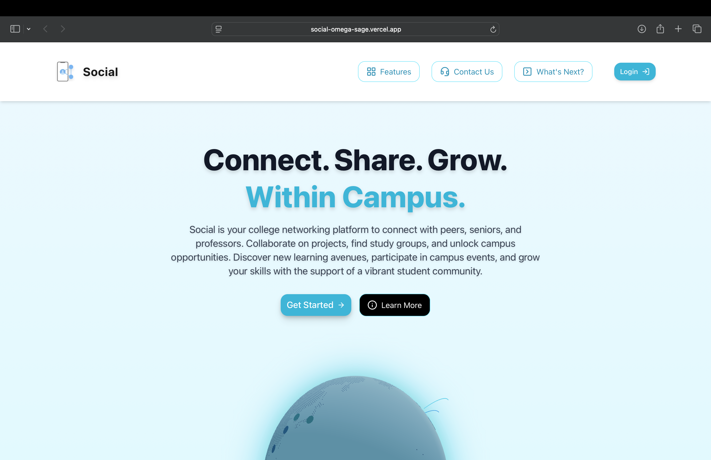
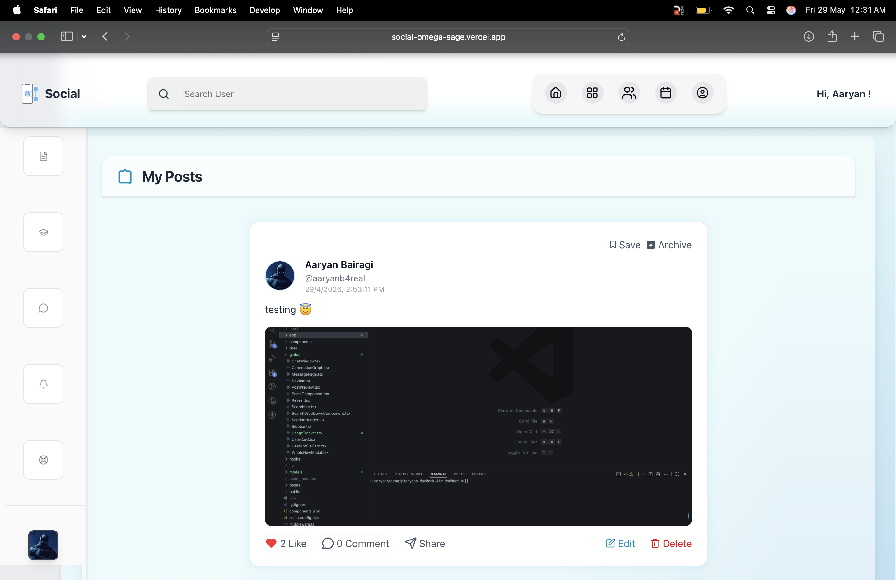
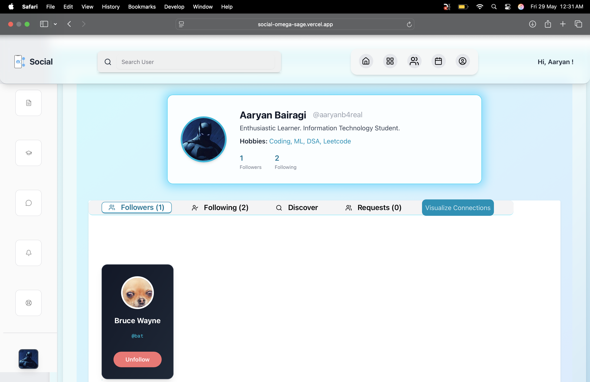
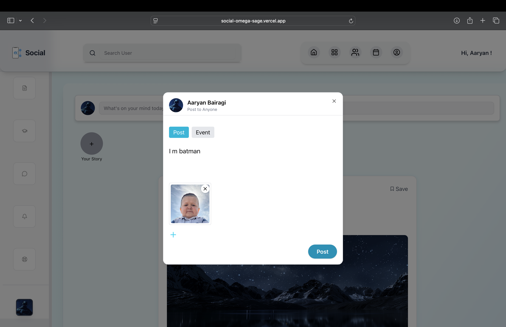
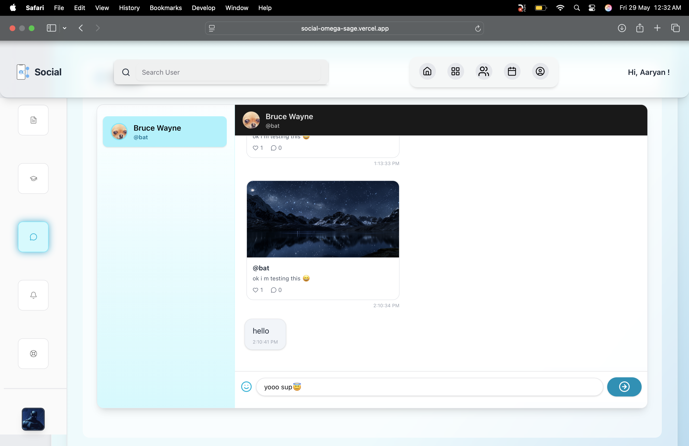
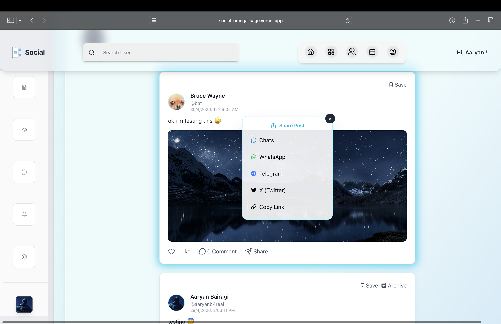
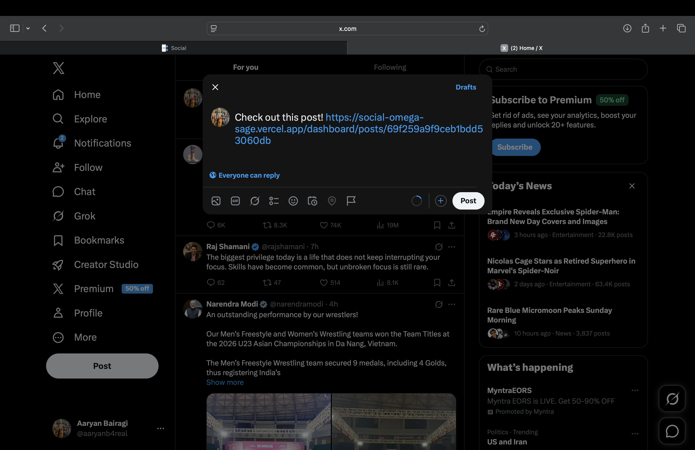
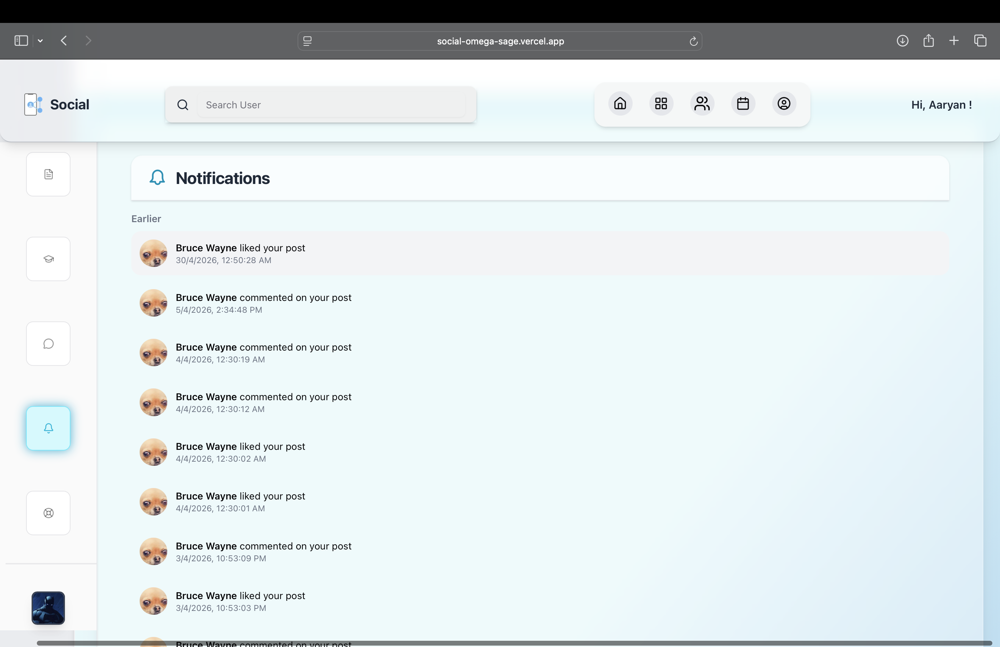

<div align="center">

# Social

</div>

<div align="center">

**A Real-Time Social Platform for Developers — Connection Graphs, Encrypted Messaging, and a Personal Knowledge Workspace in One App**

[](https://nextjs.org)
[](https://www.typescriptlang.org)
[](https://www.mongodb.com)
[](https://socket.io)
[](https://clerk.com)
[](https://tailwindcss.com)

**[Live Demo](#) · [Report Bug](https://github.com/AaryanBairagi/social/issues)**

</div>

---

## Table of Contents

* [Overview](#overview)
* [Platform Architecture](#platform-architecture)
* [Core Features](#core-features)
* [Real-Time Messaging & Encryption](#real-time-messaging--encryption)
* [Database Schema](#database-schema)
* [Technology Stack](#technology-stack)
* [Project Screenshots](#project-screenshots)
* [Local Development Setup](#local-development-setup)
* [Environment Variables](#environment-variables)
* [Current Status & Known Tradeoffs](#current-status--known-tradeoffs)
* [Roadmap](#roadmap)
* [Author](#author)

---

## Overview

Social is a full-stack social networking platform built for developers and technical communities — combining a content feed, a bidirectional connection graph, end-to-end encrypted real-time messaging, and a personal notes/file workspace into a single application.

Most social-platform side projects stop at "posts + likes + comments." Social goes further into the systems that actually make a platform feel alive:

| Capability | How it's handled |
|---|---|
| Real-time 1:1 messaging | Socket.io with per-message AES-256-GCM encryption |
| Social graph visualization | An interactive 3D connection globe (`three-globe` + `@react-three/fiber`) alongside a traditional follow/request model |
| Personal workspace | A notes + file system with folders and an in-app PDF viewer, separate from the public feed |
| Engagement | Likes, threaded comments, saves, and archiving, all rate-limited per user/action |
| Retention insight | Session-time tracking with daily/weekly usage analytics |
| Discovery | A lightweight recommendation engine for suggested connections |

The system is built around a scalable feed and social-graph architecture, with a strong emphasis on component reuse, typed API contracts, and clear service-layer boundaries between routes and data access.

---

## Platform Architecture

Social is structured as a modular full-stack application composed of several system layers.

### Authentication Layer

Handles identity and session management via **Clerk**.

Responsibilities:
* Sign up / sign in, session validation, and route protection at the middleware level
* Synchronizing Clerk identities with a corresponding MongoDB user document
* Gating all API routes and pages behind a valid session

### Content Management Layer

Responsible for post creation, editing, retrieval, and lifecycle.

Responsibilities:
* Post persistence, pagination, and feed generation
* Like/comment/save/archive state, each independently rate-limited
* Post metadata (media, timestamps, engagement counts)

### Real-Time Communication Layer

Manages live, encrypted messaging between users.

Responsibilities:
* Socket.io connection lifecycle (join, message, read-receipt events)
* AES-256-GCM encryption/decryption of message payloads at rest
* Unread-count tracking and read-state synchronization across sessions

### Social Graph Layer

Manages connections and discovery between users.

Responsibilities:
* Follow requests: send / accept / reject / cancel / unfollow
* Bidirectional connection state with cached request lists
* An interactive 3D visualization of a user's connection graph
* Lightweight recommendation logic for "people you may know"

### Personal Workspace Layer

A private, non-social space for the user's own content.

Responsibilities:
* Folder-organized notes and file uploads
* In-app PDF rendering for uploaded documents
* Isolated from the public feed — visible only to its owner

### Media Storage Layer

Handles file uploads and cloud asset delivery via **Cloudinary**.

Responsibilities:
* Media upload processing and optimization
* Secure delivery URLs and CDN distribution

### Database Layer

Handles persistent application state via **MongoDB / Mongoose**.

Stores: user profiles, posts, comments, connections, notes, chat messages, notifications, stories, and usage records.

---

## Core Features

### Dynamic Social Feed
Text and media posts with likes, threaded comments, saves, and archiving — each action independently rate-limited to prevent abuse.

### Connection System with 3D Visualization
A traditional follow/request/accept model paired with an interactive 3D globe rendering of a user's connection graph, built with `three-globe` and `@react-three/fiber`.

### Encrypted Real-Time Messaging
Socket.io-powered 1:1 chat with AES-256-GCM encryption applied per message before persistence, plus read-receipts and live unread counts.

### Personal Notes & File Workspace
A folder-based notes system with file uploads and an embedded PDF viewer — a private workspace layered on top of the social platform rather than a separate feature.

### Notifications
Event-driven notifications for follow requests, accepted connections, and engagement, with a read/unread state.

### Usage Analytics
Client-side session tracking (via `navigator.sendBeacon` on unload) feeding daily and weekly time-spent charts, rendered with `recharts`.

### Recommendations
A lightweight "suggested connections" engine surfaced on the dashboard.

### Events
User-created events with save/RSVP-style interactions.

---

## Real-Time Messaging & Encryption

Message content is encrypted with **AES-256-GCM** before it's written to MongoDB — the database never holds plaintext message bodies. Socket.io handles delivery and presence; encryption/decryption happens at the application boundary, keyed off a server-held secret (`CHAT_ENCRYPTION_KEY`, a 32-byte key never exposed to the client).

```
Client A ──(plaintext)──▶ API/Socket layer ──AES-256-GCM encrypt──▶ MongoDB
MongoDB ──ciphertext──▶ API/Socket layer ──AES-256-GCM decrypt──▶ Client B
```

---

## Database Schema

```
User ──────────┬──────────── Post ─────────────── Comment
│ firstName     │            │ user → User        │ post → Post
│ lastName      │            │ content             │ user → User
│ userId        │            │ media               │ textMessage
│ email         │            │ likes[] → User       
│ password      │            │ savedPostsBy[]       
│ bio           │            │ isArchived           
│ interests[]   │                                   
│ socialLinks   │            Connection             Notification
│ connections[] │──────────▶ │ requester → User     │ userId → User
│ sentRequests[]│            │ recipient → User     │ actorId → User
│ receivedReq[] │            │ status                │ type
                             
Chat                          Note                    Usage
│ sender → User                │ user → User          │ user → User
│ recipient → User             │ fileUrl               │ date
│ ciphertext (AES-256-GCM)     │ description           │ timeSpent
│ iv, authTag                  │ folder
│ read (bool)                  

Story                          Contact
│ user → User                  │ name, email, message
│ mediaUrl
│ expiresAt
```

---

## Technology Stack

### Frontend

| Technology | Purpose |
|---|---|
| [Next.js](https://nextjs.org) (App Router) | Full-stack React framework |
| [React](https://react.dev) | UI component library |
| [TypeScript](https://www.typescriptlang.org) | Type-safe development |
| [Tailwind CSS](https://tailwindcss.com) | Utility-first styling |
| [Radix UI](https://www.radix-ui.com) | Accessible unstyled primitives (dialogs, tabs, tooltips) |
| [Framer Motion](https://www.framer.com/motion) / [Motion](https://motion.dev) | UI animation |
| [@react-three/fiber](https://docs.pmnd.rs/react-three-fiber) + [three-globe](https://github.com/vasturiano/three-globe) | 3D connection graph visualization |
| [Recharts](https://recharts.org) | Usage analytics charts |
| [React PDF Viewer](https://react-pdf-viewer.dev) | In-app document rendering |

### Backend

| Technology | Purpose |
|---|---|
| [Next.js API Routes](https://nextjs.org/docs/app/building-your-application/routing/route-handlers) | Serverless API endpoints |
| [Socket.io](https://socket.io) | Real-time bidirectional messaging |
| [Node.js `crypto`](https://nodejs.org/api/crypto.html) | AES-256-GCM message encryption |
| [Clerk](https://clerk.com) | Authentication & session management |

### Database & Storage

| Technology | Purpose |
|---|---|
| [MongoDB](https://www.mongodb.com) + [Mongoose](https://mongoosejs.com) | Primary document database |
| [Cloudinary](https://cloudinary.com) | Media upload, optimization, and CDN delivery |

### Infrastructure

* In-memory rate limiting (per `user:action` key) on write-heavy routes (likes, connections, notes)
* In-memory request caching for hot read paths (e.g. pending connection requests)
* [Vercel](https://vercel.com) deployment target

---

## Project Screenshots

## Authentication



---

## Home Feed



---

## Create Post



---

## Connections & 3D Graph



---

## Real-Time Messaging



---

## Notes & File Workspace



---

## User Profile



---

## Usage Analytics



---

## Local Development Setup

### Clone Repository

```bash
git clone https://github.com/AaryanBairagi/social.git
cd social
```

### Install Dependencies

```bash
npm install
```

### Start Development Server

```bash
npm run dev
```

Visit `http://localhost:3000`.

---

## Environment Variables

Create a `.env.local` file:

```env
# Clerk
NEXT_PUBLIC_CLERK_PUBLISHABLE_KEY=
CLERK_SECRET_KEY=

# Database
MONGO_URI=

# Cloudinary
NEXT_PUBLIC_CLOUDINARY_CLOUD_NAME=
CLOUDINARY_API_KEY=
CLOUDINARY_API_SECRET=

# Messaging encryption (64-char hex string = 32 bytes)
CHAT_ENCRYPTION_KEY=
```

---

## Current Status & Known Tradeoffs

Built as a demonstration of end-to-end social-platform engineering — real-time systems, encryption, social-graph modeling, and 3D visualization — rather than a production-hardened deployment. In the interest of an honest project writeup:

| Feature | Status |
|---|---|
| Post feed, likes, comments, saves, archiving | ✅ Implemented |
| Follow/connection system with request states | ✅ Implemented |
| 3D connection graph visualization | ✅ Implemented |
| Real-time messaging (Socket.io) | ✅ Implemented |
| AES-256-GCM message encryption at rest | ✅ Implemented |
| Notes/file workspace with PDF viewer | ✅ Implemented |
| Usage analytics (daily/weekly) | ✅ Implemented |
| Per-action rate limiting | ✅ Implemented |
| Authentication | ✅ Clerk (managed) — a custom JWT-based auth layer is planned; see [Roadmap](#roadmap) |
| Socket.io connection authentication | ⚠️ Not yet enforced at the transport layer |
| Rate limiting / caching persistence | ⚠️ In-memory — resets on server restart, not multi-instance safe |
| Automated test coverage | ❌ Not yet implemented |

---

## Roadmap

* [ ] Replace Clerk with a self-implemented JWT authentication system (access/refresh token rotation, httpOnly cookies, bcrypt password hashing) to bring auth in-house
* [ ] Authenticate Socket.io connections via JWT handshake verification
* [ ] Move rate limiting and caching to Redis for multi-instance correctness
* [ ] Add automated tests around auth, messaging, and the connection request state machine
* [ ] Direct message read-receipts UI polish
* [ ] Post bookmarking collections
* [ ] Content recommendation ranking beyond simple suggestion logic
* [ ] Progressive Web App support

---

## Author

Built by **Aaryan Bairagi**

Social was built to explore real-time system design, applied cryptography, social-graph data modeling, and 3D data visualization within a modern full-stack application.

GitHub: [https://github.com/AaryanBairagi](https://github.com/AaryanBairagi)

---

## License

Copyright © 2026 Aaryan Bairagi

All rights reserved. Unauthorized copying, modification, distribution, or commercial use of this software is prohibited without explicit permission.